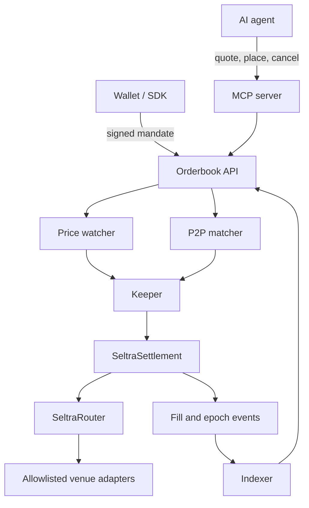

A complete Seltra integration has four cooperating components:

1. A **wallet or SDK** that builds a mandate and collects the maker's Soroban authorization entry.
2. An **orderbook service** that validates and distributes resting mandates.
3. A **keeper** that simulates and submits executable fills.
4. An **indexer** that reconciles fills and cancellations from contract events.

## Integration principles

- **Simulate immediately before submitting.** A fill that would miss `min_out` should never reach the network. Simulation is also where an incorrectly reconstructed authorization tree is caught.
- **Use integer arithmetic everywhere.** Every amount is an `i128` in token base units. Never construct or compare order amounts in floating point.
- **Re-check epoch and expiry against chain state,** not against what was true when the mandate was accepted.
- **Read adapter availability from the registry** before advertising a quote for a venue.
- **Reconcile status from contract events,** not only from orderbook state.
- **Keep signing out of servers.** The orderbook, the keeper, and the MCP server never need a maker's key, and the MCP server has no signing capability at all.
- **Plan for state archival.** Soroban storage expires; anything you depend on reading needs a TTL and bump strategy.

## Where the code lives

| Component | Repository |
|---|---|
| Soroban contracts, orderbook service, keeper | [`Seltra-Finance/Limit-Order`](https://github.com/Seltra-Finance/Limit-Order) |
| Frontend and client SDK | This repository |

The Soroban implementation is in progress. Pages in this section describe the interface it is being built against; where an artifact does not exist yet, the page says so. Delivery dates are in [Roadmap](../roadmap.md).

## Next

- [Testnet Quickstart](./testnet-quickstart.md) — toolchain, build, and deploy loop.
- [Sign an Order](./sign-an-order.md) — building and signing a mandate.
- [Orderbook API](./orderbook-api.md) — REST and WebSocket surface.
- [Keeper Integration](./keeper-integration.md) — the fill loop and its safeguards.
- [Indexing and Events](./indexing-and-events.md) — reconciling state from the chain.
- [Configuration Reference](./configuration-reference.md) — every environment variable.
