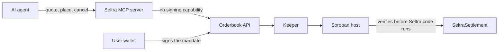

Stellar's agent tooling can already pay for things. What it has not had is a venue where an agent can *trade* without becoming a custody risk. Today that means handing an agent a private key or trusting a custodial wrapper, because no primitive scopes what an agent is actually allowed to do.

A Seltra mandate is that scope.

## The interface

Seltra exposes `quote`, `place`, and `cancel` to any AI tool through a Model Context Protocol server, and the same operations through a TypeScript SDK for non-MCP consumers.

| Operation | What it does | Signing |
|---|---|---|
| `quote` | Prices a candidate trade against current venue liquidity | None |
| `place` | Submits an already-signed mandate to the orderbook | None - the mandate arrives signed |
| `cancel` | Requests withdrawal from the orderbook, or prepares an epoch increment for the user to sign | None |

**The MCP server has no signing capability by design.** It holds no key, no seed, and no delegated signer. A mandate is signed in the user's wallet; the agent works with the result.

The quote endpoint is metered with Stellar's Machine Payments Protocol and charged per request in USDC, so agent traffic pays for the infrastructure it consumes. It is built for machine callers rather than only for human sessions.

## Why this is safe to offer

The safety property does not come from Seltra being careful. It comes from the platform: the Soroban host verifies the maker's authorization entry - signature, nonce, expiration ledger, and the exact invocation arguments - before any Seltra code runs.

A **fully compromised agent** can waste the user's mandates by placing or cancelling badly. It cannot:

- trade a different asset pair, because both token contracts are arguments of the signed invocation;
- exceed the signed size, because `amount_in` is a ceiling in the signed mandate;
- accept a worse price, because `min_out` is asserted after routing and before any payout;
- act after expiry, because the entry's expiration ledger and `order.expiry` are both checked; or
- reuse a mandate, because the nonce is single-use and consumed by the host.

The blast radius of a compromised agent is bounded by what the user signed, and the bound is enforced one layer below anything Seltra or the agent controls.

## What an agent still gets wrong

Bounded authority is not the same as good judgement. Within its mandate an agent can still place orders at prices that never fill, cancel a strategy the user wanted, or burn quote credits on nothing. Those are product and cost problems, not custody problems, and interfaces should treat them as such: show the user what was placed, make cancellation cheap, and cap metered spend.

## Integration

Practical setup - connecting an assistant, the tool schema, metering, and the SDK equivalents - is in [Build with Seltra](../build-with-seltra/index.md). The mandate an agent operates inside is described in [Order Model](./order-model.md), and the multi-mandate case in [Strategies](./strategies-grid-and-dca.md).
