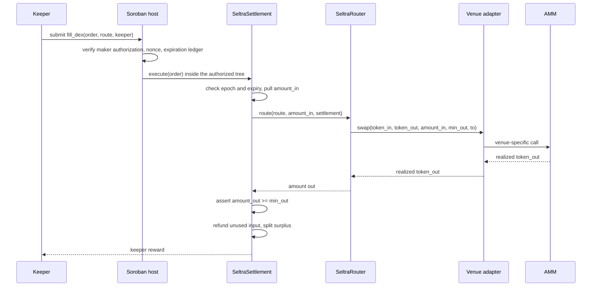

The DEX path fills one mandate by routing its input into Soroban AMM liquidity through an allowlisted venue adapter. Soroswap is the first venue; further venues follow behind the same allowlist and pause pattern.

## What the keeper controls, and what it cannot

The keeper supplies only the `route` - which allowlisted adapter, and the venue-specific hop data. Everything with economic meaning comes from the signed mandate: both token contracts, the input ceiling, the minimum output, and the maker who receives the proceeds.

This separation exists because a Soroban authorization entry commits to exact arguments. A maker who signed at 09:00 cannot name the venue a keeper will pick at 14:00, so the route lives in the keeper's call frame rather than in the maker's signed tree. See [Soroban Authorization](./soroban-authorization.md).

## Preconditions

A `fill_dex` invocation reverts unless all of the following hold:

- Fills are not paused.
- The adapter in the route is registered and not individually paused.
- The mandate's epoch equals the maker's current epoch.
- The current ledger is at or before `order.expiry`, and the authorization entry has not expired.
- The mandate's nonce has not already been consumed.
- The realized output is at least `min_out`.

The entire flow is atomic. A failure at any step reverts the token pull, the swap, the nonce consumption, and every transfer. Soroban forbids reentrancy at the host level, so a venue cannot call back into settlement mid-fill.

## Output is measured, not reported

Settlement does not trust an adapter's or a venue's return value for maker accounting. The output that matters is the balance actually delivered, and it is compared against `min_out` before anything is paid out. A malicious or buggy adapter that reports more than it delivered fails this check and reverts the fill rather than short-changing the maker.

## Resource limits bound the route

Soroban caps CPU instructions, memory, and ledger reads and writes per transaction. A multi-hop route, an optional vault redemption, and settlement all have to fit inside those limits in one invocation, so route depth is bounded rather than unbounded. Keepers discover this in simulation: a route too large to execute fails before submission and costs nothing.

## After the fill

`amount_in` is a ceiling. If the fill needs less than the ceiling to satisfy the mandate, the remainder is refunded to the maker inside the same invocation - the mandate is single-shot, but not necessarily full-size. Output above `min_out` is surplus and is split according to [Surplus, Fees and Incentives](./surplus-fees-and-incentives.md).
