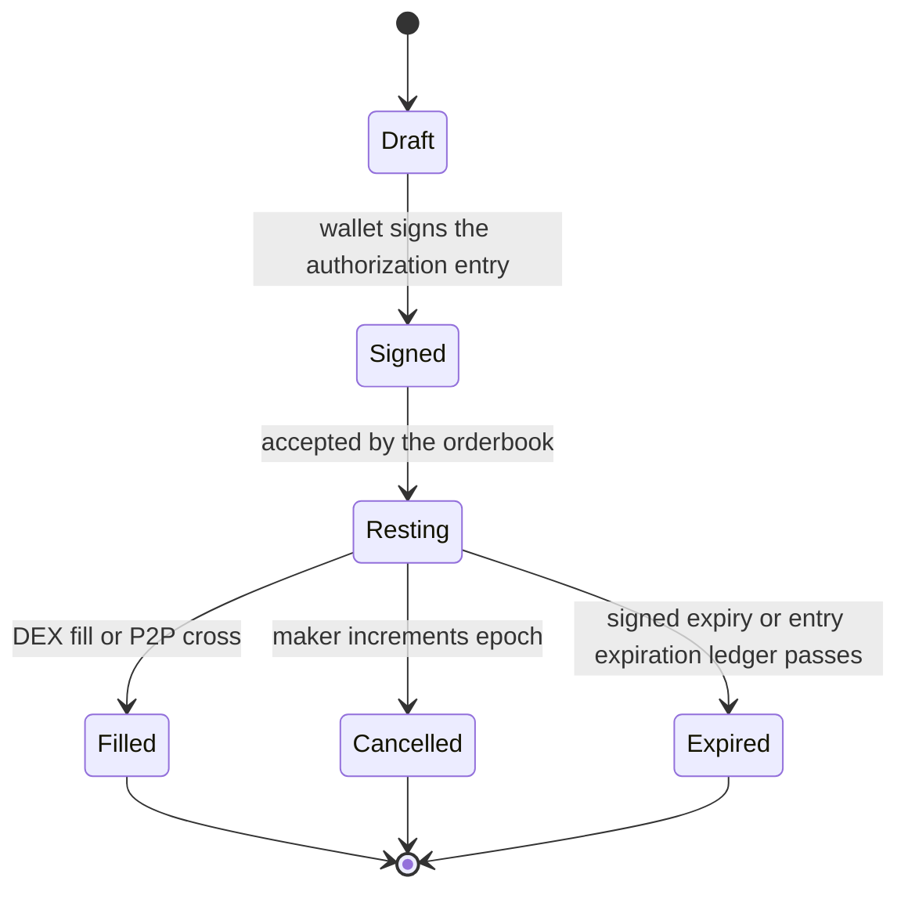

Seltra separates **order creation** from **order execution**. A maker authorizes exact exchange terms with one Soroban authorization entry. Services can store, distribute, and match those signed mandates, but only `SeltraSettlement` can consume the authorization, and only inside the bounds the host already checked.

## Lifecycle

1. **Construct.** Choose the asset pair, the maximum input, the minimum output, the expiry, and whether resting capital should earn yield.
2. **Sign.** The wallet signs one authorization entry for `execute(order)`. No transaction is submitted and no fee is paid.
3. **Rest.** The signed mandate is submitted to an orderbook service, which validates epoch and expiry against chain state before accepting it.
4. **Discover.** Keepers quote allowlisted venue adapters while the matcher looks for a crossing mandate.
5. **Simulate.** A keeper simulates the exact fill against Soroban RPC. A fill that would miss `min_out` costs nothing because it is never submitted.
6. **Settle.** The host verifies the signature, the nonce, and the expiration ledger, then invokes `execute` inside the authorized tree. Tokens move and the nonce is consumed atomically.
7. **Distribute.** Settlement asserts the signed minimum, refunds any unused input, and splits surplus between the maker and the keeper.

The first valid transaction to consume a mandate's nonce wins. A second keeper racing the same mandate fails on the consumed nonce — an expected, harmless outcome that costs the losing keeper a simulation, not the maker anything.

## Key design decisions

These are the points where Soroban differs from the EVM implementation, and where the reasoning should be visible rather than taken on trust.

### Native authorization instead of a custom signature scheme

The EVM implementation signs a Permit2 witness message and verifies it inside the settlement contract. Soroban has no equivalent need: an authorization entry is verified by the host before any Seltra code executes, and the host also owns nonce consumption and signature expiry.

Seltra therefore writes and audits **no signature verification at all**, which removes an entire class of bug. It also means the protocol works with smart wallets and passkey accounts for free, because a custom account's `__check_auth` is transparent to Seltra.

The rejected alternative was custom ed25519 verification over a domain-separated order hash. It would allow arbitrary fill semantics, but it means writing and auditing cryptography the platform already provides, and it breaks compatibility with contract accounts.

### The keeper's route is not part of the maker's authorization

An authorization entry commits to exact arguments. A maker signing at 09:00 cannot know which venue a keeper will pick at 14:00.

Seltra splits this into two entrypoints. The maker authorizes `execute(order)`, whose only argument is the order itself, so the mandate is stable and pre-signable. The keeper calls `fill_dex(order, route, keeper)`, which invokes `execute` in a sub-tree the maker's entry covers, and then routes the proceeds. The route lives in the keeper's own call frame, outside what the maker signed, and cannot affect the mandate's terms because `min_out` is asserted after routing.

### One fill per mandate; progressive execution is expressed as slices

An authorization entry carries a single-use nonce, so a mandate is filled at most once. That rules out the familiar pattern of one large resting order drawn down over many fills at different times.

It does not rule out filling *less* than the signed amount. `amount_in` is a ceiling rather than an exact spend: the contract pulls the ceiling, uses what the fill requires, and refunds the remainder to the maker in the same invocation. This is the same decoupling the SDF atomic swap example uses.

Execution spread over time is expressed by signing several mandates in one wallet interaction rather than by drawing one mandate down repeatedly. Slicing happens client-side, so the orderbook presents a set of mandates as one logical order, and a partially executed slice set is cancelled in one action by the epoch mechanism. See [Strategies](./strategies-grid-and-dca.md).

### Epoch as the cancel primitive

Every mandate carries an epoch, and `execute` reverts unless it matches the maker's stored value. `increment_epoch()` invalidates everything outstanding in one transaction.

This is cheap on Soroban, where per-order on-chain state would otherwise be both a storage cost and an archival problem. It is also exactly what a strategy needs: a grid of forty mandates is cancelled by one increment rather than forty cancellations.

The tradeoff is granularity, and it is documented rather than hidden. Cancelling one mandate out of forty is not possible through the epoch; it is done off-chain by withdrawing the mandate from the orderbook, which is not trustless. A maker who needs trustless single-order cancellation increments the epoch and re-signs the rest.

### Order lifetime is bounded by the network

An authorization entry expires at a signature expiration ledger, and the network caps how far ahead that can be set. A Seltra mandate therefore cannot rest indefinitely. Long-dated orders are re-signed on a rolling basis by the client, and the orderbook surfaces the real expiry rather than implying an open-ended order.

### Storage and archival are explicit

Soroban storage expires. Persistent storage holds the per-maker epoch counter and the adapter registry, bumped on every write and by a maintenance job. Temporary storage holds fill records, keyed by order hash with a TTL set past the mandate's expiry, so a filled mandate cannot be replayed and the entry disappears once it can no longer matter. State growth is proportional to active makers rather than to lifetime order count.

### Immutability by omission

On Soroban a contract is upgradeable only if it implements an upgrade entrypoint itself. `SeltraSettlement` is deployed without one, so nobody — including Seltra — can change the code a maker's signature points at. Every fix after launch is a new deployment and a migration. That is a deliberate cost, accepted in exchange for a signature that cannot be redirected.
