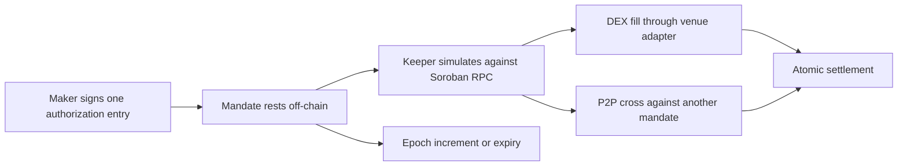

Seltra combines an off-chain orderbook with deterministic on-chain settlement. Placing an order costs a maker one wallet signature and no fee. Everything that matters - who authorized the trade, how much can move, what price is acceptable, when the authorization dies, and whether it has already been used - is enforced by the Soroban host and by `SeltraSettlement`, not by the service that stores the order.

## Mental model

A Seltra order is a **mandate**: a signed Soroban authorization entry that permits one specific invocation, with one specific set of arguments, once. It says *exchange up to this much of token A for at least this much of token B, on my behalf, until this ledger*. It rests off-chain until a keeper finds a route that satisfies it.

The maker is never asked for a second signature to make the fill happen, and never sends a transaction to place or to expire an order.

## What is enforced, and by what

| Property | Enforcement |
|---|---|
| Maker identity | Soroban authorization entry, verified by the host before Seltra code runs |
| Replay protection | Single-use nonce carried by the authorization entry and consumed by the host |
| Authorization lifetime | The entry's signature expiration ledger, capped by the network |
| Order lifetime | The signed `expiry` ledger, checked by the contract at fill time |
| Minimum proceeds | Signed `min_out`, asserted after routing and before payout |
| Maximum spend | Signed `amount_in` is a ceiling; the unused remainder is refunded in the same invocation |
| Mass cancellation | Per-maker `epoch` counter; a mismatch reverts the fill |
| Supported venues | Adapter registry behind a timelock, each adapter individually pausable |
| Emergency response | Guardian can pause fills; it cannot pause cancellation or expiry |
| Code immutability | No upgrade entrypoint exists in the deployed Wasm |
| Custody | In default mode assets stay in the maker's account until the settling invocation |

A keeper chooses only *when* to fill and *which allowlisted route* to use. It cannot change the asset pair, the size, the minimum output, the epoch, or the expiry, because those are arguments of the invocation the maker signed. This is the property that makes it safe to expose the same interface to bots and to AI agents.

## Where Soroban changes the design

Three platform facts shape everything in this section, and each has its own page.

| Fact | Consequence |
|---|---|
| The host verifies authorization before contract code runs | Seltra writes and audits no signature scheme - see [Soroban Authorization](./soroban-authorization.md) |
| An authorization entry commits to exact arguments | The keeper's route cannot be part of what the maker signs - see [DEX Settlement](./dex-settlement.md) |
| An authorization entry carries a single-use nonce | A mandate fills at most once; progressive execution is expressed as several mandates - see [Strategies](./strategies-grid-and-dca.md) |

## Read in order

1. [How Seltra Works](./how-seltra-works.md) - lifecycle, and the decisions where Soroban differs from the EVM implementation.
2. [Order Model](./order-model.md) - every field of a mandate and what it binds.
3. [Soroban Authorization](./soroban-authorization.md) - how signing, nonces, and expiry actually work.
4. [DEX Settlement](./dex-settlement.md) and [P2P Settlement](./p2p-settlement.md) - the two fill paths.
5. [Surplus, Fees and Incentives](./surplus-fees-and-incentives.md) - who gets the value above the signed minimum.
6. [Cancellation, Expiry and Pause](./cancellation-expiry-and-pause.md) - how a maker gets out.
7. [Strategies](./strategies-grid-and-dca.md), [Agents and MCP](./agents-and-mcp.md), and [Yield on Resting Capital](./yield-on-resting-capital.md) - what the one primitive is used to build.
