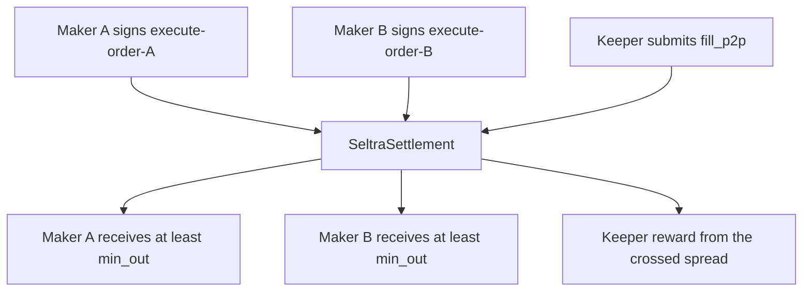

The P2P path matches two crossing mandates against each other with no AMM in the path, so there is no price impact and no pool fee. The crossed spread goes to the two traders instead of to a pool.

## Crossing condition

Let mandate A sell token X for token Y, and mandate B sell token Y for token X:

- `A.token_in == B.token_out`
- `A.token_out == B.token_in`
- B offers at least what A demands: `B.amount_in >= A.min_out`
- A offers at least what B demands: `A.amount_in >= B.min_out`

Both mandates must still be within epoch and expiry, and neither nonce may have been consumed. All comparisons are integer comparisons on `i128` values in token base units.

## Distribution

Each maker is paid at least the minimum they signed. What remains after both minimums are satisfied is the crossed spread, and it is split between the two makers and the keeper that matched them, following the same surplus rules as a DEX fill. Any input not needed to satisfy the cross is refunded to its maker in the same invocation.

Both authorization entries are consumed in that one invocation. If either signature, nonce, epoch, expiry, balance, or crossing check fails, neither mandate fills.

## Why this works natively on Soroban

The P2P path needs two makers who have never met to have their signatures matched by a third party - the keeper - inside one atomic invocation. Soroban supports this directly, and it is a documented pattern rather than something Seltra invents.

| Property | Why it matters here |
|---|---|
| Multiple authorizing addresses in one invocation | A transaction carries a list of authorization entries; two independent makers is an ordinary case |
| Signatures are not bound to a transaction | Each maker signs an invocation tree, not a transaction, source account, or fee payer |
| The pattern exists in the SDF example set | The atomic swap example settles between two parties matched by a third; the batched variant matches several in one invocation |

The batched example also points at an optimisation worth taking: several crosses can settle in one transaction rather than one transaction each.

## Design consequence: settlement routes through the contract

Each maker must be able to sign without knowing the counterparty, so the signed invocation tree cannot contain the other maker's address. Settlement therefore sits in the middle: each maker authorizes a transfer of their input to `SeltraSettlement`, and the contract pays both sides out and refunds any unused remainder.

This costs two extra token movements per cross compared with a direct maker-to-maker transfer, and that cost is what keeps the two signatures independent and pre-signable. Whether four token movements plus the surplus split fit comfortably inside the per-transaction resource limits is measured during implementation rather than assumed.

## Failure modes

| Situation | Outcome |
|---|---|
| Keeper rebuilds an invocation tree that does not match what a maker signed | The host rejects the entry and the transaction fails. A keeper operating cost, not a maker risk, and caught in simulation |
| One mandate was already filled | Its nonce is consumed; the whole transaction reverts and neither maker is affected |
| Two keepers race the same pair | The loser fails on the consumed nonce. Expected and safe |
| The two mandates no longer cross at submission time | The crossing check fails and nothing settles |
