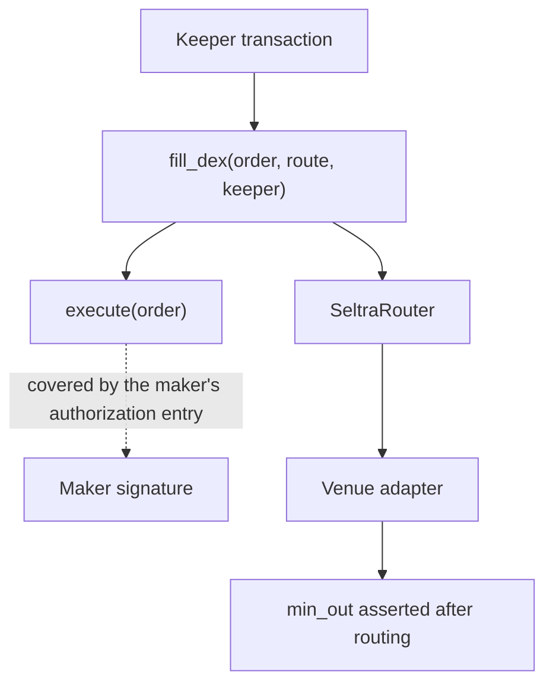

Seltra does not define a signature format, a domain separator, or a nonce map. A maker signs a **Soroban authorization entry**, and the host verifies it before the first line of Seltra code executes.

This is the single largest difference from the EVM implementation, which needs Permit2 witness messages and an in-contract verifier to achieve the same result.

## What an authorization entry commits to

| Committed | Not committed |
|---|---|
| The network | The transaction that carries it |
| The exact invocation tree: contract, function, and arguments | The source account |
| A single-use nonce | The fee payer |
| A signature expiration ledger | The submission time, within the expiration window |

The right-hand column is what makes a resting orderbook possible at all. A maker signs at 09:00 with no knowledge of who will submit; a keeper assembles and pays for the transaction at 14:00. Neither the keeper's identity nor its fee budget is part of what the maker approved.

## What the host checks, and Seltra does not

1. **Signature validity** against the maker's account - including a contract account's `__check_auth`, so smart wallets and passkey accounts work without any Seltra-side support.
2. **Nonce** - each entry carries a single-use nonce that the host consumes on success. A replayed entry fails at the host, never reaching contract logic.
3. **Signature expiration ledger** - the entry is rejected after it, and the network caps how far ahead it can be set.
4. **Invocation tree match** - the arguments in the submitted transaction must be exactly those the maker signed. A keeper that reconstructs the tree incorrectly gets its transaction rejected.

Because all four checks live in the platform, the attack surface Seltra is responsible for starts *after* authentication rather than at it.

## The signed invocation

The maker authorizes `execute(order)` and nothing else:

```rust
// The invocation the maker signs. Its only argument is the order itself,
// so the mandate is stable and pre-signable.
fn execute(env: Env, order: Order);
```

A keeper later calls `fill_dex(order, route, keeper)` or `fill_p2p(order_a, order_b, keeper)`. Those entrypoints invoke `execute` in a sub-tree covered by the maker's authorization entry, then do the routing and the payout in the keeper's own frame. The route never enters the maker's signed tree.



## Two expiries, and the earlier one wins

| Deadline | Set by | Enforced by |
|---|---|---|
| Signature expiration ledger | The signing client, capped by the network | The Soroban host |
| `order.expiry` | The maker, in the mandate | `SeltraSettlement` |

A mandate is dead at the earlier of the two. Clients should keep them aligned and surface the real expiry in the interface, rather than displaying an order as open when its authorization has already expired. Long-dated orders are re-signed on a rolling basis; there is no such thing as a good-till-cancelled mandate on Soroban.

## Multiple signers in one invocation

There is no restriction on how many addresses call `require_auth` within a single contract invocation, and a transaction carries a list of authorization entries rather than one. Two makers signing independently is an ordinary case rather than an edge case, which is what makes the [P2P path](./p2p-settlement.md) a documented platform pattern rather than something Seltra has to invent.

## Integration notes

- Never reconstruct an authorization entry by hand. Build it with the Stellar SDK or generated bindings and let the tooling assemble the invocation tree.
- Simulate before submitting. A mismatch between the tree the keeper builds and the tree the maker signed is caught in simulation, and is a keeper operating cost rather than a maker risk.
- Do not treat a stored mandate as valid because it was valid when accepted. Re-check epoch and expiry against current chain state before offering it to a keeper.
