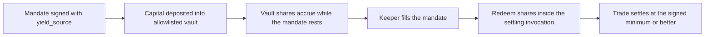

The reason traders do not leave orders open is that the capital sits idle. Seltra can route the capital behind a resting mandate into an allowlisted vault so it earns until the fill, and redeem it inside the same invocation that settles the trade.

This mode is **opt-in**, and it is opt-in because it genuinely changes the risk profile — not as a soft launch.

## Default mode versus yield mode

| | Default mode | Yield mode |
|---|---|---|
| `order.yield_source` | `None` | An allowlisted vault address |
| Where the capital sits while resting | The maker's own account | A third-party vault |
| Trust assumptions | The immutable settlement contract | Settlement, plus the vault, plus the underlying lending pool, plus its oracle |
| Oracle exposure | None — settlement reads no price feed | Inherited from the vault |
| Yield while waiting | None | Vault yield until the fill |

Default mode is the default for a reason. If a maker does nothing, funds stay in the maker's account until the moment of settlement.

## How it settles

Redemption and settlement happen in one invocation. There is no window in which the capital has left the vault but the trade has not settled.

## Exposure is capped on-chain

- Vaults are **allowlisted**, added behind the same timelocked registry as venue adapters, and individually pausable.
- A **per-vault exposure cap** is enforced on deposit, so a single vault cannot accumulate unbounded protocol-routed capital.
- The yield adapter is only reachable when `order.yield_source` is set. A default-mode mandate never touches it.

## The failure mode worth naming is liquidity, not exploit

A lending pool at high utilization cannot service a redemption on demand. Capital committed to yield can therefore be temporarily unwithdrawable, and **a mandate whose capital is stuck is a mandate that cannot fill.** That is worse than losing the yield: the maker's order silently stops being executable at the moment they most likely want it to execute.

Seltra handles this explicitly rather than discovering it at settlement time:

| Layer | Behaviour |
|---|---|
| Keeper simulation | Calls `available_liquidity` before attempting a fill and **skips** the mandate rather than submitting a reverting transaction |
| Orderbook and interface | Shows the mandate as *waiting on liquidity* — not as filled, and not as cancelled |
| Contract | Redemption and settlement are atomic, so a partial unwind cannot leave capital stranded mid-fill |

## Precedent and honesty

Vault risk on Soroban is not hypothetical. The February 2026 oracle manipulation against a Blend pool is the concrete precedent, and it is the reason this mode is capped, allowlisted, pausable, and surfaced at the point of choosing it rather than buried in documentation.

Seltra does not present default mode and yield mode as the same product. A maker choosing yield mode is choosing a different set of counterparties, and the interface states the added risk where the choice is made.
