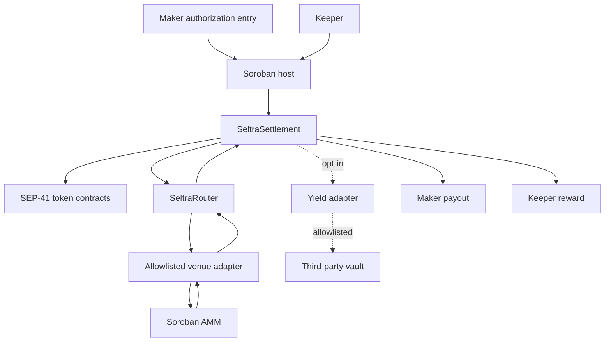

The deployed runtime is intentionally small and has no upgrade entrypoint. Mutable policy is isolated behind admin functions intended to sit behind delayed governance, and emergency response is limited to pausing.

## Trust boundaries

| Actor | Can | Cannot |
|---|---|---|
| **Soroban host** | Verify signature, nonce, expiration ledger, and the exact invocation tree | Be bypassed by any contract, including Seltra's |
| **Maker** | Authorize exact terms; cancel by epoch; let a mandate expire | Be prevented from cancelling or expiring |
| **Keeper** | Choose timing and an allowlisted route; earn surplus share | Change the pair, size, floor, epoch, expiry, or split |
| **Settlement** | Move tokens, assert `min_out`, refund, split surplus | Be upgraded, or hold a discretionary balance between invocations |
| **Router** | Call registered adapters | Hold funds or user authorization |
| **Adapter** | Translate a constrained route into venue calls | Be reached except through the router, or be added without a timelock |
| **Guardian** | Pause fills, pause one adapter - immediately | Unpause, move funds, change policy, or block cancellation |
| **Admin / timelock** | Registry activation, parameters, guardian rotation, unpause - after delay | Act instantly, or alter a signed mandate |

## Why settlement sits in the middle of a P2P cross

Each maker must be able to sign without knowing the counterparty, so the signed invocation tree cannot contain the other maker's address. Settlement therefore receives both inputs and pays both sides out, at the cost of two extra token movements per cross. That cost buys signatures that are independent and pre-signable - see [P2P Settlement](../concepts/p2p-settlement.md).

## Resource budget

CPU instructions, memory, and ledger reads and writes are capped per transaction. A fill has to fit routing, optional vault redemption, the `min_out` assertion, the refund, and the surplus split into one invocation. Route depth is therefore bounded by design, and whether the four-transfer P2P path plus the split fits comfortably is a measurement taken during implementation rather than an assumption.

## State layout

| State | Storage class | Lifetime |
|---|---|---|
| Per-maker epoch counter | Persistent | Bumped on write and by a maintenance job |
| Adapter and vault registry | Persistent | Bumped on write and by a maintenance job |
| Fill record, keyed by order hash | Temporary | TTL set past the mandate's expiry, then archived |

Keeping fill records temporary is what stops state from growing with lifetime order count. It also means the chain is not a historical archive: an indexer, not contract state, is the source for reporting. See [Indexing and Events](../build-with-seltra/indexing-and-events.md).
