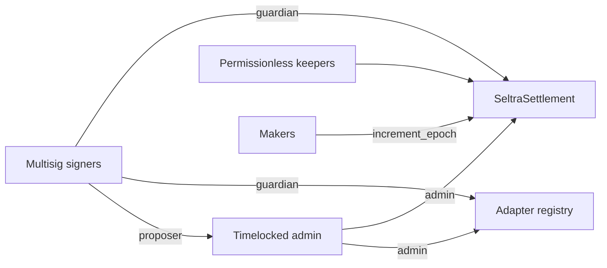

The topology separates **fast emergency response** from **delayed policy change**, and gives neither any power over an outstanding mandate beyond stopping fills.

## Capabilities

| Capability | Principal | Delay |
|---|---|---|
| Fill a valid mandate | Any keeper | None |
| Cancel all own mandates | The maker | None |
| Let a mandate expire | Nobody - it is automatic | None |
| Pause all fills | Guardian | None |
| Pause one adapter or vault | Guardian | None |
| Unpause | Admin / timelock | Delayed |
| Activate a proposed adapter or vault | Admin / timelock | Delayed |
| Change token policy | Admin / timelock | Delayed |
| Change surplus parameters | Admin / timelock | Delayed |
| Rotate the guardian | Admin / timelock | Delayed |
| Change the settlement code | **Nobody** | - |

The last row is the one that matters most. `SeltraSettlement` has no upgrade entrypoint, so there is no governance path - delayed or otherwise - to changing the code a maker's signature points at.

## Guardian power is strictly negative

A guardian can only take capability away, and only for future fills. It cannot unpause, cannot move funds, cannot change parameters, and cannot stop a maker from cancelling or a mandate from expiring. A compromised guardian is a denial-of-service problem with a bounded blast radius, not a custody problem.

## What governance cannot reach

| A maker's outstanding mandate | Governance effect |
|---|---|
| Its asset pair, size, floor, epoch, expiry, and surplus split | None - they are inside a signature already given |
| Its ability to be cancelled | None - `increment_epoch` is never pausable |
| Its ability to expire | None |
| Its ability to be filled | Can be paused |

Changing token policy or surplus parameters affects mandates signed afterwards. It cannot rewrite one already signed.

## Operating requirements before mainnet

The governance shape above is exercised on testnet with a minimal signer set, which is adequate for staging and is **not** a production signer policy. Before mainnet, all of the following are required and none is complete:

- a distributed signer threshold with documented, separated key custody;
- a published timelock delay, with proposals visible while pending;
- rehearsed pause and unpause drills against a live stack;
- a documented incident path naming who can pause and how they are reached; and
- an independent audit covering the governance surface, not only the fill paths.

Current state is tracked in [Mainnet Status](../networks-and-deployments/mainnet-status.md).
