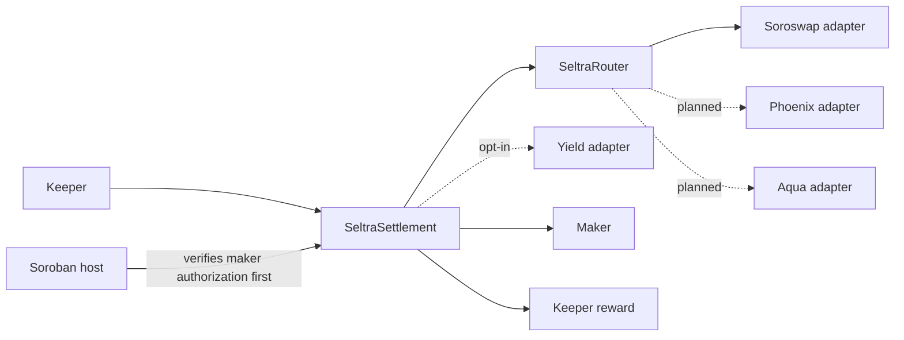

Seltra's contracts separate **order economics** from **venue execution**. `SeltraSettlement` verifies the mandate, moves tokens, and distributes proceeds. `SeltraRouter` dispatches to allowlisted venue adapters, and each adapter contains one venue's calling convention.

Everything is written in Rust against the Soroban SDK and compiled to Wasm.

## Contract roles

| Component | Responsibility | Holds funds? |
|---|---|---|
| `SeltraSettlement` | Mandate verification, token movement, `min_out` enforcement, refunds, surplus split, keeper reward, epoch state, pause | Only transiently, inside one invocation |
| `SeltraRouter` | Chooses and calls a venue adapter, returns the output amount | No |
| Venue adapter | Wraps one AMM behind a common interface | No |
| Adapter registry | Timelocked allowlist of venue adapters and yield vaults, with immediate pause | No |
| Yield adapter (opt-in) | Deposits resting capital into an allowlisted vault and redeems inside the settling invocation | Routes to a third-party vault |

A bug in the router or an adapter cannot drain a maker, because neither holds funds and neither holds user authorization. That is the point of the split.

## Design boundaries

- **No upgrade entrypoint.** On Soroban a contract is upgradeable only if it implements that itself; `SeltraSettlement` does not. Every fix is a new deployment and a migration.
- **No arbitrary call targets.** The router calls registered adapter addresses, never a keeper-supplied target with keeper-supplied calldata.
- **No oracle in the settlement path.** Price comes from the venue quote or the crossing mandate and is checked against the maker's signed `min_out`. Oracle exposure exists only inside the opt-in yield adapter, inherited from the vault.
- **Output is measured, not reported.** Adapter and venue return values are not trusted for maker accounting.
- **Registration is timelocked; pausing is immediate.** Adding capability is slow, removing it is fast.
- **No reentrancy.** The Soroban host forbids reentrancy, so a venue cannot call back into settlement mid-fill.

## Status

The Soroban implementation is in progress and is not deployed to any network. This section documents the interface it is being built against; the authority for a live network is always the specification of the contract deployed at that address, and bindings generated from it. See [Networks and Deployments](../networks-and-deployments/index.md) and [Roadmap](../roadmap.md).

Use the child pages for the architecture, per-contract methods, adapters and registry, events and errors, and governance.
