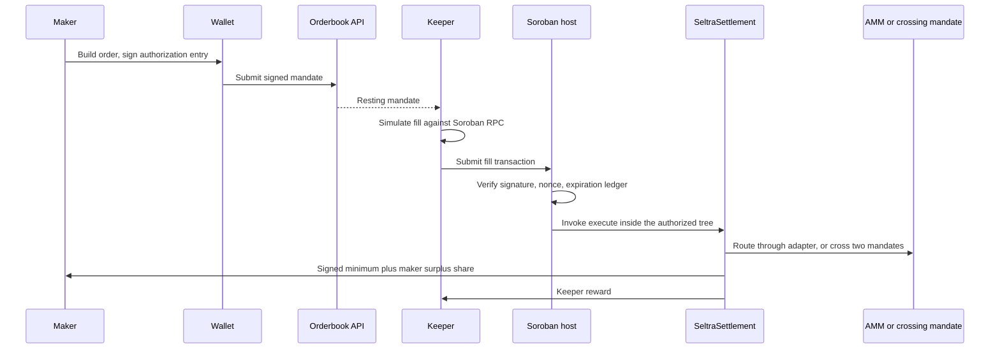

Seltra is programmable order execution on Soroban, Stellar's smart contract platform. A maker signs one Soroban authorization entry that fixes the asset pair, the size, the minimum output, and the expiry. Nothing moves and no fee is paid until something fills the order inside those bounds. Whatever does the filling - a permissionless keeper, a strategy, or an AI agent - cannot exceed what was signed, because the Soroban host verifies the mandate before Seltra's code runs.

One primitive covers several products. A single mandate is a limit order. A set of mandates sharing one epoch is a grid or a DCA schedule. The same contract interface is reachable from an MCP server, so an agent can trade for a user without ever holding a key.

## Status

Read this before treating any page here as a production claim.

| Layer | State |
|---|---|
| Soroban settlement, router, adapters | Specified in this documentation; implementation in progress, not deployed |
| Stellar Testnet deployment | Planned - see [Roadmap](./roadmap.md) |
| Stellar Mainnet deployment | Planned after external audit - see [Mainnet Status](./networks-and-deployments/mainnet-status.md) |
| Independent security audit | Not started |
| Same settlement design, EVM implementation | Live on Avalanche C-Chain mainnet - see [Traction](./traction.md) |

The design is not theoretical: the same two-path settlement model runs in production on another chain today, and this documentation describes how it is rebuilt natively on Soroban rather than ported. Where a page describes something that does not exist yet, it says so.

## Why Seltra

| Property | What it means |
|---|---|
| One signature, no custody | The maker authorizes one invocation. In default mode assets stay in the maker's account until the moment of settlement. |
| Native authorization | Signature, nonce, and expiry are checked by the Soroban host. Seltra writes and audits no signature scheme at all. |
| Two settlement paths | Fills route into Soroban AMM liquidity through an allowlisted adapter, or cross directly against another mandate with no AMM in the path. |
| Maker-protective | Every path must return at least the signed minimum. Anything above it is surplus, split between the maker and the keeper who found it. |
| No upgrade entrypoint | The settlement contract is deployed without one, so nobody - including Seltra - can change the code a signature points at. |
| Bounded delegation | An agent or bot operates strictly inside the signed mandate. That bound is enforced by the platform, not by trusting the agent. |

## How an order moves

## Start here

| Need | Page |
|---|---|
| Understand the protocol | [Concepts](./concepts/index.md) |
| Understand what a mandate is and what it binds | [Order Model](./concepts/order-model.md) |
| Understand why agents can be given access safely | [Agents and MCP](./concepts/agents-and-mcp.md) |
| Build an integration, a keeper, or an indexer | [Build with Seltra](./build-with-seltra/index.md) |
| Read the contract interfaces | [Contract Reference](./contract-reference/index.md) |
| Find network configuration and addresses | [Networks and Deployments](./networks-and-deployments/index.md) |
| Trade in the app | [App Trading Guide](./concepts/app-trading-guide.md) |
| Evaluate risk | [Security](./security/index.md) |
| Check what is actually shipped | [Traction](./traction.md) |
| Check what is funded and when it lands | [Roadmap](./roadmap.md) |

## Sources of truth

Source code is not evidence of deployment, and a page here is not evidence that code exists. Use the narrowest source available.

| Subject | Canonical source |
|---|---|
| Contract behaviour, auth, limits, errors | The Rust crates and their test suites in the contracts repository |
| Deployed interface on a network | The specification of the contract deployed at that exact address |
| Generated TypeScript client | Bindings generated from the deployed contract, not from this documentation |
| Order validation and distribution | The orderbook service source |
| Environment contract | [Configuration Reference](./build-with-seltra/configuration-reference.md) |
| Deployment state and addresses | [Networks and Deployments](./networks-and-deployments/index.md) |
| What is shipped versus planned | [Traction](./traction.md) and [Roadmap](./roadmap.md) |

The public source repository is [Seltra-Finance/Limit-Order](https://github.com/Seltra-Finance/Limit-Order).
